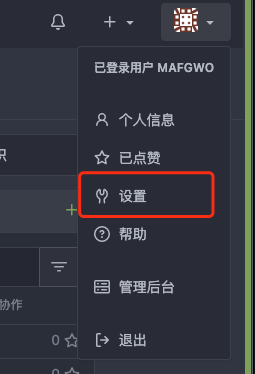

# Gitea Application Configuration Description

> If StackEdit Plus supports Gitea, you need to create an application at Gitea and fill it in when the Chinese version of StackEdit binds to a Gitea account.


# How to create a Gitea application

Create as indicated in the following figure:





After successful creation, you can see the application ID and application secret key.

# Gitea Cross Domain Issues

Due to the fact that the Chinese version of StackEdit accesses the Gitea interface directly from a browser, personally deployed Gitea needs to support cross domains. For how to support cross domains, please refer to the official documentation: https://docs.gitea.io/en-us/config-cheat-sheet/#cors -Cors (There seems to be a problem with the official cross domain support. I personally, including many netizens, have failed to support cross domain support through this configuration. If you also fail, you can try using the nginx agent to achieve cross domain support)

The nginx configuration implements cross domain configuration as follows:

```
  add_header                 Access-Control-Allow-Headers *;
  add_header                 Access-Control-Allow-Origin $http_origin;
  add_header                 Access-Control-Allow-Methods GET,POST,PUT,DELETE,OPTIONS;

  if ($request_method = 'OPTIONS') {
    return 204;
  }
```
